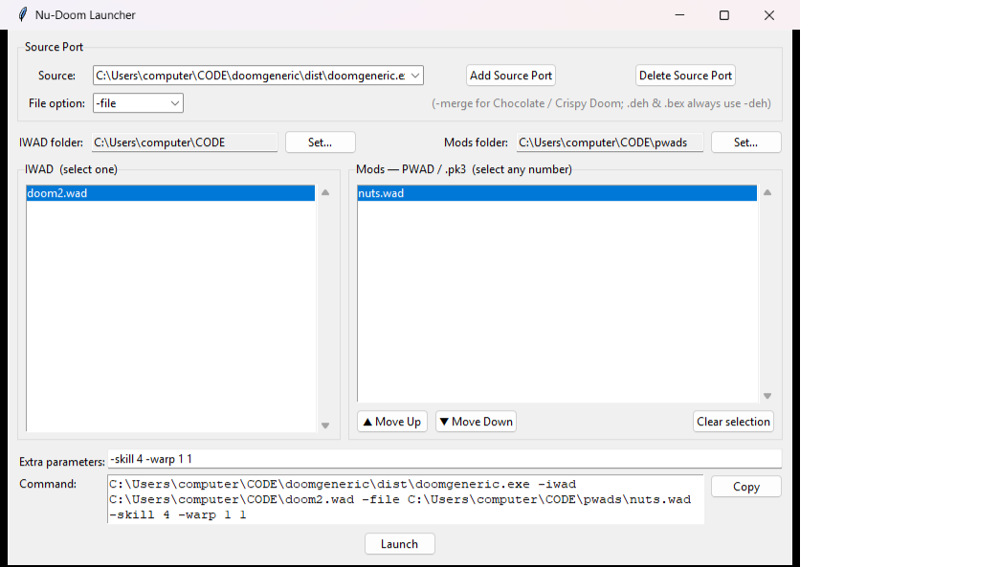

# Nu-Doom Launcher

A single-window Windows GUI for launching DOOM source ports with an IWAD and any
number of PWAD / `.pk3` mods. Built for
[Nu-Doom](https://github.com/Captain-Beefheart/Nu-Doom), but works with any
classic-style port (Crispy, Chocolate, Woof, PrBoom+) as well as GZDoom.

Pure Python standard library (tkinter) — no third-party dependencies.



## Download

Grab **`Nu-Doom-Launcher.exe`** from the
[latest release](https://github.com/Captain-Beefheart/Nu-Doom-Launcher/releases/latest)
and double-click it — it's a standalone executable with Python bundled in, so
nothing else needs to be installed.

### Or run from source

If you already have Python 3 with tkinter (the MSYS2 `mingw-w64` Python includes
it), you can skip the exe:

- **Double-click `Nu-Doom-Launcher.vbs`** — starts the app with `pythonw`, no console window.
- Run **`start.bat`** to launch with a console attached (shows tracebacks — handy for debugging).
- Or from a shell: `python nu_doom_launcher.pyw`

The `.vbs` / `.bat` look for Python in `C:\msys64\mingw64\bin\` and fall back to
whatever `python` / `pythonw` is on your PATH.

## Usage

The whole app is one window, top to bottom:

### 1. Choose a source port
- **Add Source Port** — browse to a source-port `.exe` (Nu-Doom, GZDoom, Crispy,
  Woof, Chocolate Doom, …). Add as many as you like and switch between them with
  the **Source** dropdown.
- **Delete Source Port** removes the selected port from the list only — it never
  deletes the executable itself.
- **File option** — the flag the selected port uses to load WAD/PK3 files.
  Defaults to `-file`; set it to `-merge` for Chocolate / Crispy Doom (which merge
  the PWAD lumps into the IWAD's namespaces so new sprites/flats resolve
  correctly). It's stored **per source port** — like Doom Launcher's `FileOption` —
  so each port remembers its own setting.

### 2. Pick your folders
- **IWAD folder → Set…** — the folder holding your IWADs (`doom2.wad`, `doom.wad`,
  `heretic.wad`, …). The **IWAD** list fills with the `.wad` files it finds.
- **Mods folder → Set…** — the folder holding your PWADs / `.pk3` files. The
  **Mods** list fills with `.wad`, `.pk3`, `.pk7`, `.pke`, `.ipk3`, `.deh`, `.bex`
  and `.zip` files. (The two folders can be the same one if you prefer.)

### 3. Select what to play
- Select **exactly one IWAD** from the IWAD list.
- Select **any number of mods** from the Mods list.
- **Load order matters** in Doom — use **▲ Move Up / ▼ Move Down** to arrange the
  selected mods. They load top-to-bottom in list order.

### 4. Launch
- Add optional **Extra parameters** — anything else for the port, e.g.
  `-skill 4 -warp 1 1 -complevel 9`.
- The **Command** box shows the exact command line that will run — **Copy** it or
  hit **Launch** to start the game.

## How the command is built

```
<port.exe> -iwad <iwad> <file-option> <mod1> <mod2> … -deh <patch.deh> … <extra args>
```

`<file-option>` is the selected source port's setting (`-file` by default, or
`-merge`). DeHackEd patches (`.deh` / `.bex`) are always passed separately with
`-deh`. This mirrors how Doom Launcher assembles its launch command.

## Where settings are stored

`~/.nu_doom_launcher.json` (i.e. `%USERPROFILE%\.nu_doom_launcher.json`) —
remembers your source ports (and each port's file option), folders, and extra
parameters between runs.

## Building the .exe yourself

The release executable is built with [Nuitka](https://nuitka.net/) using the MSYS2
`mingw-w64` toolchain:

```bash
python -m nuitka \
  --onefile \
  --enable-plugin=tk-inter \
  --windows-console-mode=disable \
  --onefile-tempdir-spec='{TEMP}/Nu-Doom-Launcher_{PID}_{TIME_US}_{RANDOM}' \
  --product-name="Nu-Doom Launcher" \
  --file-version=0.1.0.0 --product-version=0.1.0.0 \
  --output-filename=Nu-Doom-Launcher.exe \
  nu_doom_launcher.pyw
```

## License

Released under the [MIT License](LICENSE).
